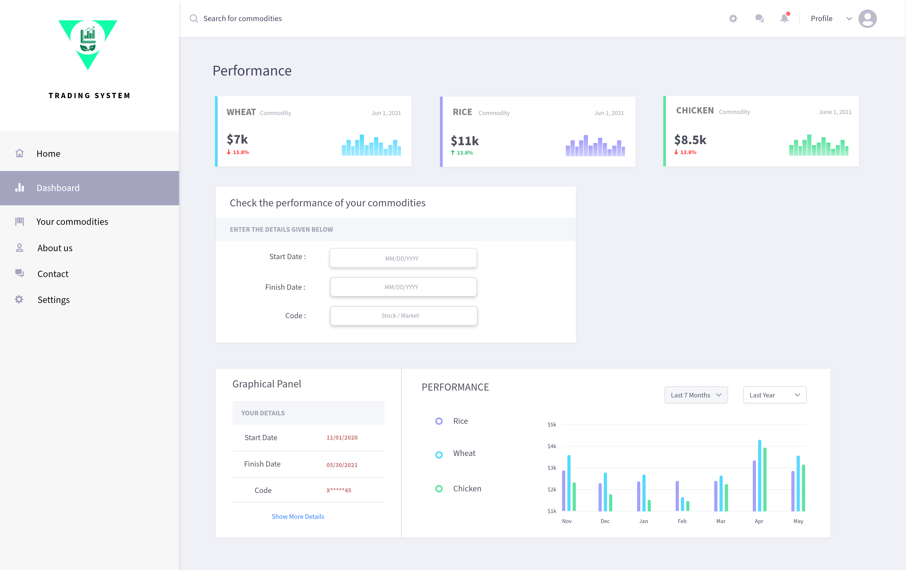

## Case Study
We are creating a website that serves as a dashboard for investment funds for mining holdings – where “mining” refers to extraction of minerals such as gold, silver, zinc, iron, aluminum, petroleum, etc. A “fund” is a collection of investments in which investors can buy shares – just like the stock market, but instead of buying shares in individual stocks, investors buy shares in the fund, which owns many investments. Experts in the field, usually from investment banks, manage these funds. In this case, such investments would include mineral mines, natural gas and oil wells, as well as the processing plants needed to turn the raw materials into usable commodities.

The dashboard will allow professionals in this field, such as buyers, appraisers and managers of such mines and processing plants to monitor commodity prices (for example gold prices) and prices of land in certain geographic areas. It also shows interest rates, and cost of labour in certain geographic areas as well as mortgage rates and performance indicators for the economy (such as employment statistics).

## Description
 
This system of financial trading would be highly beneficial for exchanging goods for the professionals due to various reasons. These include:
* **Protection against inflammation:** Due to increase in demand of goods and services, there is increase in their prices of commodities. In such scenario, interest rate rises which will reduce profit margins leading to inflammation. But in this trading system, professionals will be able to save and protect their capital from the effects of inflation and maintain their value.
* **High Profits:**  Commodity trading can help one to make more profits due to the insignificant fluctuation in the prices of the commodities which can result in huge discounts and gains. Hence, the possibility of return increases.
* **More Accessible** In comparison to traditional system of trading, this online trading makes its more accessible for all platforms to buy and sell their goods and services. Each person would able to buy any product from anywhere which makes it a more beneficial system as compared to others.
* **Fair Price:** This trading platform helps in deciding a fair price for both the buyer and the seller. It eliminates the risk of any kind of manipulation which enables transparency. Hence, it help agricultural products to arrive at an accurate and market-oriented price
* **Diversification:** Commodity prices are prone to weather conditions and supply demand. Accordingly, commodities are an independent asset class, and can prove to be an effective means of diversification in one’s investment portfolio.

## Target Market

The software mainly focuses on trading which means buying and selling of online commodities and is mainly directed at people who want to do trading of the agricultural commodities such as wheat, barley, rice, pork, chicken, etc. These people could be the professional traders, investors, people who do import and export, producers, farmers or a large-scale consumer of the product.

This aspect will surely influence the design as it will be created according to the psychology of people of all age groups, making sure that the colors are vibrant enough, and do not create problems for the one who have disabilities. Also, in order to look to have an easy focus on the website, the font size of text should be big enough so that it can be easily accessible to all. Overall, the website will be following and addressing its content according to the principles derived laid by the WCAG guidelines.

## Installation

No need to rely on installing any external dependencies or services. Just download the zip folder to see the web and logo designs.

## Usage

Use this site to view the designs of the projects. In addition, this portfolio showcase my skills in the field of UX/UI Design in order to get job offers.

## License
Distributed under the MIT License. 

I have chosen this license because it is simple, permissive and optimized for developers. Its free of charge without limiting the rights to use, copy, modify, merge, publish, distribute and sublicense and/or sell copies of the Software. A significant benefit of using the MIT license is that it serves both sides of the debate equally well. Due to the MIT License’s open language, it’s suitable for both community developers and teams that want to produce propriety software using existing pieces of MIT licensed code.

## Contact
Email: livjyotsingh.ca@gmail.com

Portfolio: https://livjyot.github.io/My-Portfolio/
